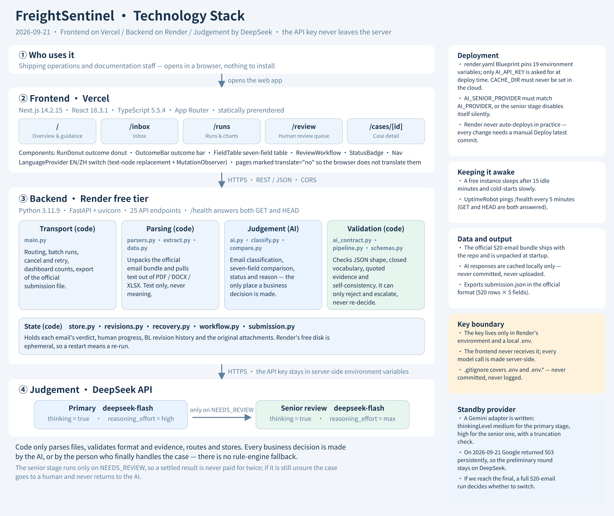

# FreightSentinel

**Shipping document verification - from a shared inbox to a discrepancy report.**
Built for the Averis x Monash Hackathon 2026 (Shipping Document Verification use case).

**Live prototype:** https://fs-two-sand.vercel.app/

**Demo video:** [YouTube](https://www.youtube.com/watch?v=VvE_S-22u-I) · **[higher-quality original on Google Drive](https://drive.google.com/file/d/1bgl4TA7SAE1CsN9b2Zo-3_wfLXRMlKx5/view?usp=sharing)**
> YouTube's compression softens the small on-screen text - the field-by-field comparison and the
> source evidence are easier to read in the Drive copy.

> 中文版说明见 **[README.zh-CN.md](README.zh-CN.md)**（部署步骤与环境变量中文对照）。

FreightSentinel reads the shared operations inbox, tells the five kinds of emails apart, and for every
BL-comparison request it reads the Shipping Instruction (SI) and the draft Bill of Lading (BL), aligns the
seven shipment fields by meaning, and reports **exactly** what differs - with the source evidence next to
it. Anything the system cannot decide safely (missing attachment, wrong document, unreadable file, blank
value) goes to a person with the reason, never a guess.

```
Official Inbox -> Smart Inbox (classify) -> Analyse (extract + compare) -> Risk Radar -> Review or Safe Completion
```

## Start here

**Nothing needs to be installed or run.** The deployed instance has already analysed all 520 emails from
the participant bundle, and the results are on screen when the page opens.

| | |
|---|---|
| Try it | **https://fs-two-sand.vercel.app/** |
| API | https://freightsentinel-api.onrender.com/health |
| Language | the switcher in the top right does English / 中文 |

A sixty-second tour:

1. **[Today Work Centre](https://fs-two-sand.vercel.app/)** - the counts, and underneath them the cases
   already sorted with the most urgent first. The strip at the top says what to do next.
2. **Open the first mismatch** from *Risk Radar*. The seven fields are laid out side by side, SI on the
   left and draft BL on the right, and every reading carries the exact line it was taken from. Tick
   *show source lines* to see them.
3. **[Review Queue](https://fs-two-sand.vercel.app/review)** - everything waiting on a person: the
   confirmed mismatches, and the cases the system refused to decide with the reason attached. The second
   group is where the system says "I don't know" instead of guessing.
4. **[Batch Run](https://fs-two-sand.vercel.app/runs)** - the record of the full 520-email run and the
   official export.

**The first page load may take up to a minute.** The backend is on a free instance that sleeps when idle;
once it is awake the app is immediate.

### Running it yourself

**This repository contains no API key, and it cannot contain one.** A local clone will start, serve the
interface and read the bundled emails, but every classification and comparison will fail with a visible
technical error until you put your own provider key in `backend/.env`:

```dotenv
AI_PROVIDER=deepseek
AI_API_KEY=<your own DeepSeek key>
AI_MODEL=deepseek-flash
```

That is deliberate: the key is a server-side secret, it is never committed, never sent to the browser and
never printed in a log. The full variable list is in [Environment variables](#environment-variables), and
[Run locally](#run-locally) has the commands.

**If you want to see the system working, use the deployed link above** - it is already configured and
already has the results.

## Architecture



```
Browser ──> Next.js frontend (Vercel) ──/api/*──> FastAPI backend (Render) ──> parsers (txt/pdf/docx/xlsx)
                                                            │                 ──> AI provider (DeepSeek / OpenAI / Anthropic / Gemini)
                                                            │                 ──> AI verdict + response/source validation
                                                            └──> results cache (JSON)
```

The browser never talks to the AI provider and never sees the API key. The frontend proxies `/api/*`
server-side to the backend; the key exists only as an environment variable on the backend host.

| Layer | Technology | Responsibility |
|---|---|---|
| Frontend | React + Next.js 14 (TypeScript) | Today Work Centre, Smart Inbox, Case Detail, Review Queue, Batch Run |
| Backend | Python 3.11 + FastAPI + Pydantic | inbox access, analysis pipeline, batch runs, human decisions, submission export |
| Parsing | pdfplumber, python-docx, openpyxl | attachment text with a layout-aware PDF reader (bold label / regular value) |
| AI | one provider with JSON output, via plain HTTPS | email intent + category, document type + seven fields with evidence |
| Comparison | AI structured response | semantic comparison, unit interpretation, seven match flags and final status |
| Validation | Python / Pydantic | response shape, complete fields, source excerpts and consistency of AI status |

**AI owns business decisions.** The configured model classifies emails, identifies documents, extracts all
seven fields, interprets equivalent names/units, compares values and returns the final status with evidence.
Python reads files and validates response structure, source excerpts and internal consistency; it does not
compute its own business verdict or override AI readings. Invalid AI output goes to review. Missing AI
configuration or API failure is a visible technical failure with retry, never a rules-only success.
`AI_MODE=full` is the normal configuration; `off` disables analysis.

### Why the AI decides, and not a rule engine

We started from the opposite plan: rules first, AI only as a fallback. We changed our minds after
looking at what the rules would actually be learning.

The supplied emails and documents come from a template generator. A rule set written against them can
be made to score very well - but what it would be recognising is *the generator*, not a Bill of Lading.
Every layout it handles is a layout someone chose in advance. The first real document with a label
spelled differently, a field in another order, or an address continued across a page break falls
outside every rule that was written, and a rule engine's failure mode is not a question - it is a
confident wrong answer. High accuracy on this dataset would have told us almost nothing about accuracy
on the next one, which is the only accuracy a shipping team can use.

Training our own model was the other option, and the dataset is the reason it was not worth it. Model
training earns its cost when the data is large and varied enough to teach something a general model
does not already know. These 520 emails are neither, so training would have produced a second, weaker
way of overfitting the same generator.

That leaves reading the documents with a model that already understands how shipping paperwork is
written. So the AI makes every business judgement, and the program's job is the part a program is
actually good at: reading files, validating that the model's answer is well formed, checking that each
quoted excerpt exists in the source, and refusing the answer when it is not. There is no rule that
quietly supplies a verdict when the AI fails, because a rule-derived `OK` and a verified `OK` look
identical on the report - and the whole value of the report is that they do not.

What this costs us is honest: a model call per email, seconds rather than milliseconds, and a bill.
A deterministic pipeline over this dataset would be faster and cheaper. It would also be measuring
the wrong thing.

## Cloud architecture

Three cloud services, each doing work the product cannot do without.

| Component | Service | What it actually does here |
|---|---|---|
| Decision layer | DeepSeek API | Every business verdict. Two distinct model configurations form a tiered decision path: a primary pass at `reasoning_effort=high`, and a second pass at `max` for cases the first one would not decide. |
| Backend | Render (free web service) | The pipeline, the inbox API, batch runs, human decisions and the official export. Deployed from `render.yaml` as a Blueprint. |
| Frontend | Vercel | The workspace, statically prerendered and served from the edge, proxying `/api/*` to the backend so the browser never holds a key. |

**The cloud is core functionality, not hosting.** The product has no rule engine and no offline mode:
if the provider is unreachable the case becomes a visible technical failure and goes to a person. There
is no local path that produces a verdict. The tiered escalation is likewise a cloud design - two model
configurations at different reasoning depths, with the second one called only when the first declines to
decide. In the latest full run that was 42 senior calls against 742 primary ones, so the deeper, slower
configuration is paid for only where the first pass stopped, not across all 520 emails.

**Infrastructure as code.** `render.yaml` pins 19 environment variables - provider, both model tiers,
thinking effort, timeouts, rate limits, fallback behaviour and batch concurrency. Deploying asks for
exactly one value, `AI_API_KEY`, marked `sync: false` so it never enters the repository. The consequence
is that the deployed service is reproducible from this repository and provably runs the configuration
that was tested, rather than whatever was last clicked into a dashboard.

**Written for cloud provider limits, not around them.** A sliding-window pacer caps requests per minute
per model; batch concurrency is bounded; HTTP 429 and 503 rest the primary model for a cooldown window
and route to a fallback model; retries are capped so an unusable answer is never requested repeatedly;
and truncated model output is detected and escalated instead of being parsed as a verdict.

**Operational loop.** Render health-checks `/health`, which answers both `GET` and `HEAD` because uptime
monitors default to `HEAD`. An external monitor polls it every five minutes, which also keeps the free
instance from sleeping. `/health` reports service, data and AI status separately, so a green page and a
broken provider are distinguishable.

### What this tier costs, and how it scales

The service started on Render's free tier and now runs on Standard (1 CPU / 2 GB) with a 1 GB disk.
Both the reason for moving and the limits that remain are listed here.

| Limit | Effect today | Next step |
|---|---|---|
| Single instance | A service with a disk cannot run more than one instance, and deploys are no longer zero-downtime | Accepted deliberately: the store is in-process, so a second instance would hold a second, divergent copy of the same state. Managed Postgres is what removes this, and it is on the roadmap rather than in this build. |
| 512 MB on the free tier | `BATCH_CONCURRENCY` had to stay at 4 while several PDFs parsed at once, and a full run took 16 min 24 s | Resolved by moving to Standard: the same run at `BATCH_CONCURRENCY=64` takes about 3 minutes, with no application change. |
| Model latency, now the floor | Raising concurrency from 32 to 64 saved 4%. CPU sits at a 5% baseline and memory never passes 20%, so the instance is not the constraint | A run cannot finish faster than its slowest single email - one primary call plus one senior review, which is sequential by design. Only a model that needs less deliberation shortens it. |
| Sleep on the free tier | Cold starts looked like a broken prototype | Removed by the paid instance; the uptime monitor still runs. |

A full-inbox run is currently an in-process asyncio batch. Moving it behind a queue with separate workers
would let a restart resume a run instead of failing it, and would let throughput scale by adding workers
rather than by raising concurrency inside one instance. That is the natural next piece of cloud
architecture, and it is deliberately not in the preliminary-round build.

## Repository layout

```
backend/    FastAPI service  (app/main.py = routes, app/pipeline.py = the analysis, tests/ = pytest)
frontend/   Next.js app      (app/ = pages, components/, lib/api.ts)
data/       official participant bundle (sdoc-hackathon-bundle.zip) - extracted at backend startup
docs/       confirmed workflow diagram + workflow contract
render.yaml Render blueprint for the backend
```

Development test records (per-email JSON/CSV runs and their reports) are kept on the working machine and
are deliberately not committed - see `.gitignore`.

## Environment variables

Every value below is read from the process environment. Locally they come from `backend/.env`
(gitignored, created from `backend/.env.example`); in the cloud they are set in the host's dashboard.
**No key is ever committed, logged, or sent to the browser.**

### Backend (Render → Service → Environment)

| Variable | Required | Default | Meaning |
|---|---|---|---|
| `AI_PROVIDER` | yes | `none` | `deepseek` \| `openai` \| `anthropic` \| `gemini` \| `none` |
| `AI_API_KEY` | yes | – | provider key. Backend only. Set it in the host dashboard, never in the repo |
| `AI_MODEL` | no | provider default | competition config: `deepseek-flash`. Defaults per provider in `app/config.py` |
| `AI_MODE` | no | `full` | `full` = AI decides every case; `off` = analysis disabled |
| `AI_THINKING` | no | `false` | extended thinking on the primary model (`true` in the competition config) |
| `AI_REASONING_EFFORT` | no | `high` | `low` \| `high` \| `max` (`medium` maps to `high`) |
| `AI_TIMEOUT` | no | `60` | seconds before a single AI call is abandoned (`240` recommended) |
| `AI_FALLBACK_MODEL` | no | – | same-provider backup used while the primary returns 429/503; `none` disables |
| `AI_MAX_RPM` | no | provider default | requests per minute per model; `0` = no pacing (paid tier) |
| `BATCH_CONCURRENCY` | no | `4` | parallel analyses during a full-inbox run |
| `AUTOMATION_POLICY` | no | `standard` | `standard` \| `strict`; review guidance for the AI, not a program threshold |
| `CORS_ORIGINS` | no | `*` | browsers allowed to call the API directly; the frontend proxies server-side |
| `AI_SENIOR_PROVIDER` | no | `openai` | provider for the second-pass review stage |
| `AI_SENIOR_MODEL` | no | – | second-pass model; **blank disables the senior stage** |
| `AI_SENIOR_API_KEY` | no | reuses `AI_API_KEY` | only needed when the senior provider differs from the primary |
| `AI_SENIOR_THINKING` | no | `false` | extended thinking on the senior model |
| `AI_SENIOR_REASONING_EFFORT` | no | `high` | competition config: `max` |
| `AI_SENIOR_TIMEOUT` | no | `120` | seconds before a senior call is abandoned |
| `AI_SENIOR_MAX_RPM` | no | derived | `0` = no pacing |
| `PYTHON_VERSION` | Render only | `3.11.9` | already set in `render.yaml` |

### Frontend (Vercel → Project → Settings → Environment Variables)

| Variable | Required | Example | Meaning |
|---|---|---|---|
| `BACKEND_URL` | yes | `https://freightsentinel-api.onrender.com` | FastAPI base URL, no trailing slash |

The frontend has **no** AI variables. Anything given to the frontend is readable by any visitor, so the
provider key never appears there.

### Competition configuration (DeepSeek V4.1 Flash)

```
AI_PROVIDER=deepseek
AI_MODEL=deepseek-flash
AI_MODE=full
AI_THINKING=true
AI_REASONING_EFFORT=high
AI_FALLBACK_MODEL=none
AI_SENIOR_PROVIDER=deepseek
AI_SENIOR_MODEL=deepseek-flash
AI_SENIOR_REASONING_EFFORT=max
AI_TIMEOUT=240
AI_SENIOR_TIMEOUT=240
```

The client calls `https://api.deepseek.com/chat/completions` with JSON output. Model naming follows the
[official DeepSeek API guide](https://api-docs.deepseek.com/zh-cn/). An enabled provider is configuration
evidence only; live verification requires successful calls and per-case `ai_used` / document
`extraction_method` results.

## Run locally

Backend (Python 3.11):

```bash
cd backend
python -m venv .venv && source .venv/bin/activate      # Windows: .venv\Scripts\activate
pip install -r requirements.txt
cp .env.example .env                                   # then fill AI_API_KEY in .env
uvicorn app.main:app --reload --port 8000
# http://localhost:8000/health   http://localhost:8000/docs
```

`backend/.env` is loaded automatically by `app/config.py`; real environment variables always win, so the
same code runs unchanged on Render.

Frontend (Node 18+):

```bash
cd frontend
npm install
BACKEND_URL=http://localhost:8000 npm run dev
# http://localhost:3000
```

Tests (no paid API calls - fixtures only):

```bash
cd backend && AI_PROVIDER=none AI_MODE=off .venv/bin/pytest -q tests
```

## Deploy

### 1. Backend on Render

1. Render → **New +** → **Blueprint** → select this repository (it reads `render.yaml`).
2. Render asks for **one** value: `AI_API_KEY`. Paste the provider key. Every other variable -
   provider, both models, thinking effort, timeouts, rate limits, concurrency - is pinned in
   `render.yaml`, so the cloud run matches the tested local configuration.
3. Deploy, then check `https://<service>.onrender.com/health` - it reports service, data and AI status.

The service runs on Render's Standard tier with a 1 GB disk, so it does not sleep and results survive a
restart. The uptime monitor still polls `/health` every 5 minutes as a health signal rather than as a
keep-alive. The blueprint does not install Tesseract/Poppler, so local OCR recovery is unavailable on
that host.

### 2. Frontend on Vercel

1. Vercel → **Add New** → **Project** → import this repository.
2. **Root Directory = `frontend`**.
3. Environment Variables: `BACKEND_URL = https://<service>.onrender.com`.
4. Deploy. The rewrite in `next.config.mjs` proxies `/api/*` to the backend server-side, so the browser
   needs no CORS and receives no backend URL or key in its bundle.

### 3. Key rotation

The key exists only in the Render dashboard and in the local gitignored `backend/.env`. To rotate it,
change the value in Render and redeploy; nothing in the repository or the frontend has to change.

## API

| Route | Purpose |
|---|---|
| `GET /health` · `GET /api/health` | service, data and AI status |
| `GET /api/emails` · `GET /api/emails/{id}` | inbox list / one email with attachment metadata and result |
| `GET /api/emails/{id}/attachments/{index}/text` | extracted attachment text |
| `POST /api/analyse/{id}` · `GET /api/results` · `GET /api/results/{id}` | analyse one email / stored cases |
| `POST /api/runs/full-inbox` · `GET /api/runs` · `GET /api/runs/{id}` · `POST /api/runs/{id}/cancel` · `POST /api/runs/{id}/retry/{email_id}` | batch processing with visible failures and retry |
| `POST /api/cases/{id}/decision` | confirm · escalate · resolve · reopen (human in the loop) |

**What escalating does, and does not do.** It keeps the case open, records who flagged it and why,
and sorts it above everything else in the review queue. It routes nothing and notifies nobody -
there is no supervisor mailbox behind it. It is an audit action with a position in the queue, and
the roadmap's access control system is where a real routing step would belong.

| `POST /api/cases/{id}/manual-review` | human category, outcome, defect fields, handling note |
| `POST /api/cases/{id}/revision` · `GET /api/cases/{id}/revision/{revision_id}/file` | generate / download a corrected BL copy |
| `POST /api/cases/{id}/readings` · `POST /api/cases/{id}/attachments` | corrected readings / replacement attachments |
| `POST /api/cases/{id}/correction-draft` | editable correction email text - never sent by the system |
| `GET /api/submission` · `GET /api/submission/status` | output in the official `sample_submission.json` shape (all 520 email ids) |
| `GET /api/export.csv` | the operations report: one row per differing field, with the SI and BL readings side by side |
| `GET /api/dashboard` → `summary.defects_by_field`, `defect_cases`, `defect_cases_multi` | how many comparisons differed on each field, and how many drafts were wrong in more than one place |
| `GET /api/dashboard` · `GET/POST /api/settings/policy` · `GET /api/categories` | Today Work Centre data · automation policy · category enum |

## Outcome contract

| Situation | status | review_reason | UI |
|---|---|---|---|
| all seven fields agree | `OK` | – | *No mismatch detected* -> Safe to complete (auto under policy) |
| at least one field differs | `MISMATCH` | – | High risk, `defect_fields` listed with SI / BL values |
| comparison requested but no attachment / only the SI | `NEEDS_REVIEW` | `missing_attachment` | Needs review |
| second attachment is an invoice / packing list / certificate | `NEEDS_REVIEW` | `wrong_doc_type` | Needs review |
| empty, corrupt or image-only file | `NEEDS_REVIEW` | `unreadable` | Needs review |
| a required field is blank or a placeholder | `NEEDS_REVIEW` | `missing_value` | Needs review |
| request to *send* the draft BL (nothing attached yet) | `OK` | – | *Draft BL requested* -> action list, not the review queue |
| other categories | `OK` | – | No action |

A blank or invalid value is not a discrepancy. All seven comparisons must complete reliably before an
OK or MISMATCH is returned. Unknown document roles are never inferred from filenames alone.

### Why a request to send the draft BL is reported as OK, not NEEDS_REVIEW

This is the one judgement call in the contract above, it affects 91 of the 220 comparison emails, and it
is a decision rather than a measurement. The reasoning, in full:

**What these emails actually are.** They do not ask us to check anything. They ask us to *send out* a
draft bill of lading so the counterparty can check it later. Nothing is attached because nothing is
supposed to be attached yet. The process has not reached a comparison; it has not failed one.

**Why not `NEEDS_REVIEW`.** That status means a person has to decide something the system could not.
Here there is nothing to decide: no document is late, nothing was lost, and a human reading the email
would reach the same conclusion the system did. Routing all 91 into the review queue buries the 20 cases
that genuinely need a person underneath 91 that a human would open and immediately close. Removing that
kind of noise is the point of the product.

**Why `missing_attachment` in particular is wrong here.** That reason describes a comparison that could
not be performed because a document which should have arrived did not. In these emails no document was
ever expected. Recording them as a failed comparison would put something in the report that did not
happen.

**What we are less sure about.** The contract defines `OK` as "all seven fields match", and here there
are no fields to match, so `OK` is not a perfect fit either. The closed vocabulary has three values and
none of them means *this request does not involve a comparison*. We chose the value that does not invent
a problem, and we made sure the interface never hides the difference: these 91 appear in their own
**Draft BL requested** list with the action to take, and are never counted as verified comparisons. If
the organisers intend them to be escalations instead, the change is one branch in
`backend/app/pipeline.py` and one paragraph in `backend/app/ai.py`.

### The confirmed workflow


Also available as a [scalable SVG](docs/FreightSentinel-%E7%A1%AE%E8%AE%A4%E7%89%88%E6%B5%81%E7%A8%8B%E5%9B%BE.svg) and written out as the
[workflow contract](docs/%E7%A1%AE%E8%AE%A4%E7%89%88%E6%B5%81%E7%A8%8B%E8%AF%B4%E6%98%8E.md).

## Corrected BL copies and human review

For a verified mismatch, **Generate corrected BL copy** changes only the differing fields in a separate
TXT / DOCX / XLSX / PDF file, using AI-extracted SI values. AI must re-read the actual generated file and
confirm all seven fields. PDF editing is conservative: ambiguous positions, unsupported fonts, overlaps or
insufficient space are reported as requiring manual editing; no unverified copy is saved.

- `PENDING_HUMAN_APPROVAL`: a rechecked copy or human-reviewed report awaits adoption.
- **Adopt revision & keep copy** verifies the saved file hash and retains it; adoption makes no new AI call.
- **Reject & delete copy** deletes the generated backend copy and returns the case to human review. The
  audit record remains. Files already downloaded elsewhere are outside backend control.
- Human reviewers can supply replacement SI/BL attachments or correct all seven extracted readings. The
  final human-review form can complete handling independently of AI.
- Original attachment detection and official export remain unchanged by later corrections. Reanalysis is
  blocked after human handling; reopening stays with a person.
- Unknown categories remain in the human queue and block complete submission export until classified.
- Uncertain primary results are reviewed once by the configured senior model; unresolved cases go to a
  person. No second provider is required.

Generated files live under `backend/.cache/revisions/<email_id>/<revision_id>/`. Results, human review
history and batch history are persisted under `CACHE_DIR` (gitignored).

### Local OCR recovery

Install Tesseract (English data) and Poppler (`pdftoppm`) on the backend host to enable OCR. The pipeline
first tries another PDF reader, then bounded local OCR for existing PDFs/images. Missing or wrong documents
are never synthesized. Recovery failure is visible in document evidence. The Render blueprint does not
install these OS binaries.

## Evaluation boundary

Only the participant bundle is used as input, and the organisers' private reference labels are never
opened. No prompt, threshold or routing rule in this repository was derived from a known answer: every
change is argued from what the email and the two documents themselves say.

Offline workflow tests use an explicit fake model in `backend/tests/fakes.py`; they do not call paid APIs
and do not prove model accuracy. Full-inbox live-run records are kept on the development machine and are
not part of this repository.

## Validation evidence

The current cloud snapshot below was verified on 2026-09-21 through the deployed stack:
browser → Vercel → Render → DeepSeek. It supersedes the earlier 61 / 48 / 111 snapshot, which was
produced before draft-BL action requests were separated in the UI.

| Current cloud run | Result |
|---|---|
| Emails processed | 520 / 520 |
| Wall time | 3 min 20 s at `BATCH_CONCURRENCY=64` (runs land between about 2.5 and 3.5 minutes) |
| Batch failures | **0** |
| Model failures | retried, never converted into a verdict - a failed call is reported as a technical failure, not as an `OK` |
| Non-comparison emails (classified only) | 300 |
| Safe completed comparisons | 63 |
| Draft BL requested action items | 91 |
| `MISMATCH` | 46 |
| `NEEDS_REVIEW` | 20 |

The 220 emails currently classified as `BL_COMPARISON` therefore appear in the UI as 63 safe
comparisons + 91 draft-BL action requests + 46 mismatches + 20 review cases. Across the complete
official export, including the 300 non-comparison emails, the status distribution is 454 `OK`,
46 `MISMATCH`, and 20 `NEEDS_REVIEW`.

The 20 review cases spread across all four allowed reasons. The most recent full run put them at
`missing_attachment` 6, `missing_value` 5, `unreadable` 5, `wrong_doc_type` 4; earlier runs of the same
pipeline over the same inbox produced 5 / 5 / 5 / 5. We report that drift rather than quote whichever
number looks tidiest. It is real, it is small, and it has a cause: a few of these emails sit genuinely on
the boundary between two reasons - an attachment that arrived but cannot be read, a field that is absent
rather than contradictory - and a language model asked to choose one label will not always choose the same
one. What has been stable across every run is the part that carries weight: 520 analysed, 220 comparisons,
and 20 cases held back for a human.

An earlier snapshot of this run had them at 9 / 5 / 4 / 2, because a senior-review call that failed for
technical reasons replaced the verdict the primary model had already produced with the generic
`unreadable` handoff. A technical failure is not a business finding, so the escalation path now keeps the
primary finding and records the senior failure alongside it. `email_507` is the case that still hits a
senior token-limit failure in this run: it keeps `missing_attachment` from the primary pass and carries
the warning *"Senior review did not complete ... The primary finding was kept."* The regression is covered
by `backend/tests/test_senior_handoff.py`.

We have never opened the organisers' answer key, so no distribution here is proof of correctness. What
it does show is that no single reason dominates, which is the shape a deliberately constructed edge-case
set would have - and it was the lopsided 9 / 5 / 4 / 2 split that first pointed at the bug above.

**Throughput and concurrency.** The run is bounded by model latency, not by application code. The full
inbox of 520 emails completes in about three minutes, and the backend spends almost all of that time
waiting on the provider. `BATCH_CONCURRENCY` is the single dial, and it is the reason the deployment
looks the way it does: at concurrency 4 on a 512 MB free instance the same run took 16 min 24 s, because
memory could not hold many simultaneous PDF parses. On the Standard instance the dial is at 64 - roughly
a five-fold speed-up with no change to any application code. Attachment parsing is dispatched to a thread pool rather
than run on the event loop, so raising the dial buys real parallelism instead of queueing work behind one
parse. Speed is not a scoring criterion; it matters here because a 520-email inbox has to be demonstrable
inside a five-minute video.

`GET /api/submission` was checked field by field against the organisers' `sample_submission.json`:
520 keys, no gaps or extras, the same five fields on every record, same types.

**What this does and does not show.** It shows the pipeline runs to completion on real
infrastructure, that failures are visible rather than silently converted into passes, and that the
result is reproducible across environments. It does **not** establish business accuracy — no answer
key was read, and the known issues below are unresolved.

## Challenges faced

**Field labels versus field values — resolved in the current run.** Emails 383, 411 and 498 previously
treated `To the Order of:` versus `Consignee:` as a value mismatch even though the underlying company
was identical. The current deployed run classifies all three as `OK` and explains that the label wording
differs while the party value agrees.

**A technical failure must not overwrite a valid finding — fixed.** Senior-review calls that exceed the
model output limit used to hand the case over with a generic `unreadable` reason, discarding the more
accurate finding the primary pass had already produced. Escalating safely is not enough if the escalation
destroys what was already known, so a senior call that fails for technical reasons now keeps the primary
finding and records the failure beside it. `backend/tests/test_senior_handoff.py` covers the regression.
One senior call still hits the limit in the current run, on `email_507`, and that case now keeps its
`missing_attachment` reason.

**A human saving progress must not restate the reason — fixed.** Recording partial human handling wrote
`missing_value` over whatever reason the case already had. Saving progress is not a new finding, so the
established reason is now kept.

**Refusing to guess is a feature, not an error path.** Invalid JSON, quoted evidence that cannot be
found in the source, incomplete field sets — each is rejected by validation and sent to review with
the reason. The temptation is to fall back to rules and return something; the system does not, because
a rules-only `OK` is indistinguishable from a verified `OK` to the person reading the report.

**Configuration drift between local and cloud.** `AI_SENIOR_PROVIDER` defaults to `openai`. Deployed
without it, the senior provider no longer matches the primary, the API key is not reused, and the
second-pass review **disables itself without raising an error** — the service reports healthy and
produces plausible output while quietly running a different pipeline than the one that was tested.
Every variable is now pinned in `render.yaml` so the deployment cannot silently diverge from the
tested configuration.

**Cold starts look exactly like a broken prototype.** The backend sleeps after 15 minutes of
inactivity on the free plan. The first request then returns 503 for 30–60 seconds, and the dashboard
renders "0 emails" — indistinguishable from a system that does not work. An uptime monitor polling
`/health` keeps the service warm during the judging window.

**Results used to disappear on every deploy — fixed.** On the free plan there is no persistent disk, so
the instance filesystem held the only copy: a redeploy or a restart discarded a completed run, and
pushing to `main` during a batch destroyed it. The service now runs on a paid instance with a 1 GB
persistent disk mounted at `/var/data`, and `CACHE_DIR` points inside it, so results, human decisions,
generated BL copies and supplemental files survive a restart. The lesson was that "it works until
someone deploys" is not a working prototype.

## Future roadmap

**An access control system.** The backend's write endpoints are currently open: anyone who knows the
address can start a full re-run, change a human conclusion or clear the results. That is acceptable for a
demonstration and not acceptable for real use. The next piece of work is proper access control - sign-in
and identity, roles that decide what each person may do (a read-only observer, an operator who can make
decisions, an administrator who can change configuration), rate limiting on writes, and an audit log of
who changed what and when. The read endpoints should not be open to everyone either: they contain
customer names, cargo and ports.

**State beyond a single instance.** A persistent disk now keeps the store, the BL copies and the
supplemental files across restarts, but it is still one JSON document owned by one process, which is why
the service cannot scale past a single instance. Managed Postgres is the next step: it is what history,
the audit trail and human conclusions really want, and where the access control system above has to keep
its users and roles. It is out of scope for the preliminary round on purpose - it changes how the service
starts up, and a half-finished version of that is worse than the honest limitation.

**Reading harder documents.** Install Tesseract and Poppler on the backend host to enable the bounded
local OCR recovery the pipeline already implements but cannot currently use on Render, and evaluate a
vision-capable model for scanned and image-only pages.

**A real inbox.** Replace the static participant bundle with IMAP or Microsoft Graph so the system reads
the operations mailbox directly instead of a delivered dataset.

**Bringing your own emails.** The inbox is the delivered dataset and the interface offers no way to add
to it: a team cannot point this at a backlog of their own without editing files on the server. The work
is an upload path - .eml files or a folder dropped into the browser, validated, written to the disk the
service now has, and parsed through exactly the same attachment pipeline the bundle goes through - plus
a way to keep separate sets apart so one upload does not overwrite another. It sits here rather than in
this build because the round is scored on the supplied 520 emails: an upload feature adds no evidence
for that, and a half-finished one would add risk to the part that is actually assessed.

**Learning from the review queue.** Every human correction already records the confirmed category,
outcome, defect fields and a note. Feeding those back as evaluation cases turns the review queue into
a regression suite that grows as the system is used.

**A measurable baseline.** Automate the full-inbox run and the structural audit in CI so any prompt or
model change is compared against the previous run email by email before it is adopted, rather than
judged by a single sample.
